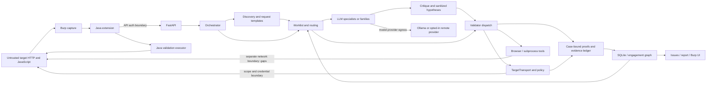
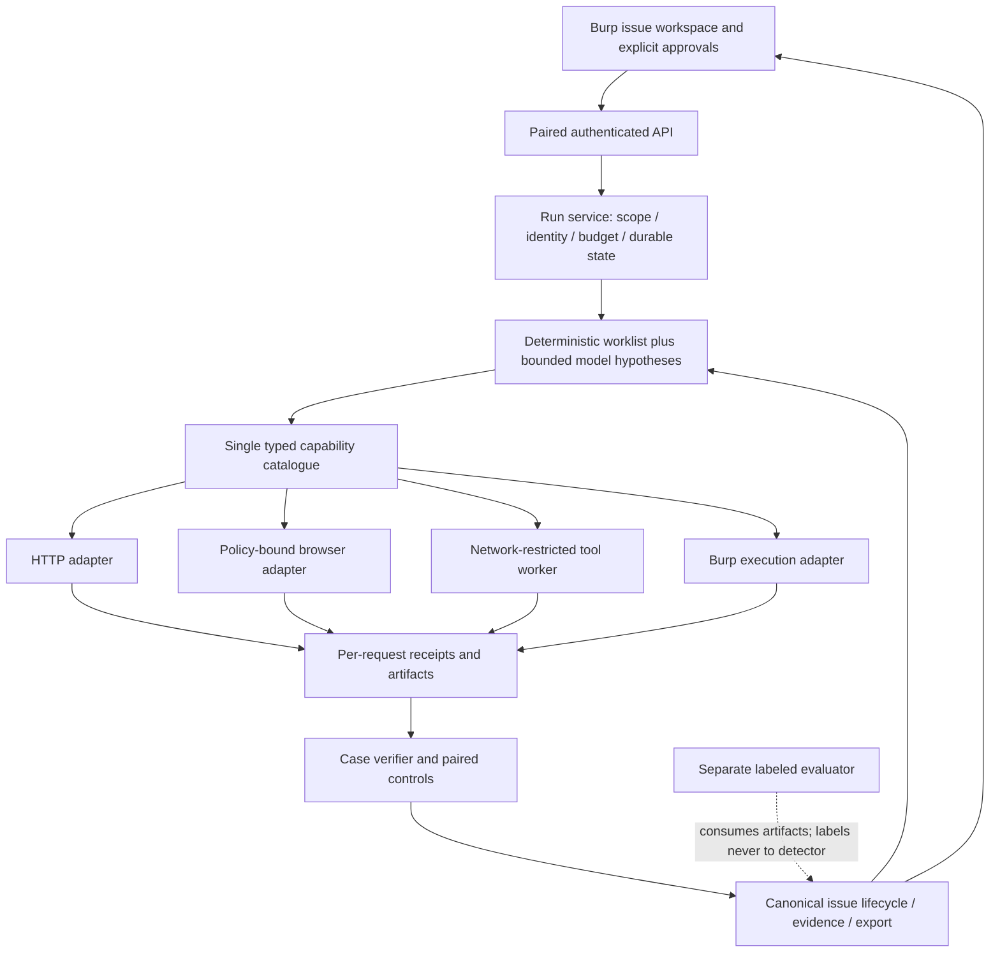

# AgenticBurp: principal technical and product review

Review date: 2026-09-24. Reviewed checkout: `reconciliation-backlog`,
`ca4ee15f0b45edc271363a53d6733c90bcde7127`, plus the pre-existing untracked benchmark
artifacts and implementation-path document. Origin matches
`https://github.com/ArthurTesta/AgenticBurp.git`. The public main page is a different,
older-looking product/documentation surface; this is primarily a review of the
local revision, not a claim that every observation applies to current remote main.

Evidence labels: **VERIFIED** means inspected source or executed observation,
with that boundary stated; **SUPPORTED** means multiple corroborating indications;
**CLAIMED** means documentation/vendor assertions; **INFERRED** means judgment;
**UNKNOWN** means unestablished. Historical run artifacts remain historical even
when their arithmetic is independently checked. Scores are review judgments, not
benchmark measurements. No hidden keys or blind target implementations were read.

## 1. Executive verdict

**INFERRED: AgenticBurp is an advanced practitioner-tool prototype with useful
engineering foundations, not a demonstrated autonomous pentesting product or an
enterprise-ready platform.** I would use its passive output as suggestions under
expert supervision. I would not rely on its negative results, aggregate recall,
or confirmation labels without checking the underlying evidence. I would keep
browser/tool-driven active testing in an isolated authorized lab until the
execution boundaries below are fixed and exercised.

The strongest design choice is separating model hypotheses from deterministic
execution and case-bound evidence. The strongest prospective product is a
private Burp companion that turns selected suspicious traffic into defensible,
replayable evidence with less analyst effort. The current project has not shown
that outcome reliably enough. Large specialist counts and graph sophistication
are not substitutes for measuring analyst time and supported findings.

The review found concrete problems beyond the prior benchmark discussion:

1. Browser execution checks only the initial target and gives captured headers
   to a browser context without request interception. This bypasses the normal
   transport's scope, credential, budget and cancellation enforcement.
2. The normal API requires a generated token for POSTs, but the Burp client only
   reads an environment token. Default health checks can succeed while analysis
   fails authentication.
3. Fresh canonical test runs failed in this environment on audit-log file
   initialization. Earlier green results cannot be carried forward as current.
4. Ablation B defaults to a SQLi specialist, F is a fail-open policy change, and
   C's historical row still records model calls. These are not the advertised
   general-agent/strong-model/no-model experiments.
5. Saved blind benchmarks use a different reporting/routing configuration from
   checked-in defaults, in addition to the known scoring defects.

Five immediate decisions:

- Complete BP-0/BP-1a/BP-1b/BP-2: explicit labels, exact-class scoring, separate
  evidence grading, one maintained runner. Do not spend another long GPU run
  interpreting the current scores as vulnerability recall.
- Close browser and external-tool network boundaries before broadening active use.
- Repair the Burp/API authentication handshake and obtain a reproducible Java
  build plus a real Burp-to-API-to-report acceptance test.
- Make stage health and evidence incompleteness visible; fix writable log
  initialization and remove the equivalence between no starvation and success.
- Recruit a small consultancy pilot around one workflow: paired authorization
  testing and evidence handoff. Freeze new agent families and platform expansion
  until that workflow beats manual Burp on measured analyst time.

I would fund a six-week evidence-and-workflow milestone, not commit six months
unconditionally. Continue only if the product demonstrates safe execution,
supported precision, and repeated practitioner value. Current competitor claims
make a generic Burp AI assistant a weak business position (section 15).

## 2. Product reconstruction

**VERIFIED in source:** the Java extension captures selected Burp traffic,
serializes it through `HarnessClient.analyze`, and displays Python analysis.
Python provides HTTP APIs, model routing, deterministic detectors/validators,
engagement orchestration, storage and report generation. Java also has its own
validation executor, creating a second execution plane to audit.

The intended job is prioritizing investigation of captured web/API traffic and
helping a tester substantiate hypotheses. It is neither a replacement proxy nor
a demonstrated replacement for a human pentester.

| Stage | Actual mechanism and source | Evidence limit |
|---|---|---|
| Capture | `LlmHarnessExtension`, `HarnessContextMenu`, `HarnessClient.analyze` | Source reviewed; no Burp UI session executed |
| API | `server.analyze` -> shared `Orchestrator`; mutation auth middleware | HTTP contract exists; default Java token gap remains |
| Passive analysis | `DetectMixin.analyze`: scope, budget, routing, agent batches, critique, deterministic observations, validation eligibility, persistence | Passive means no enabled active target probes, not necessarily no model/advisory egress |
| Selection | `DetectMixin._choose_agents`, fast-path selector, coordinator fallback | Heuristics and models select work; no proof of optimal selection |
| Findings | `BaseAgent.run` parses structured output and sanitizes authority fields | Model schema validity is not factual validity |
| Active engagement | `server.engagement_investigate` admits a scoped cancellable job; `ChainMixin.investigate_engagement` builds/investigates surface | Separate path from captured replay; not benchmarked by replay-only numbers |
| Discovery | `engagement_builder`, role crawl, API surface and declared workflows | Captures and roles become replayable request templates |
| Priority | `SurfaceEndpoint.fused_score`: severity/confidence, LLM rating, path tier, access anomalies, input-bearing shape; validated/dead routes demoted | Explainable heuristic weights, not calibrated risk probabilities |
| Confirmation | Registry applicability + active gates + class-specific validators; proof persistence before setting confirmation in reviewed path | Validator soundness and proof completeness still matter |
| Chaining | `chain_linker.link_findings`, class-pair rules and finding-to-capability transformations | Potential chain is a hypothesis, not a completed exploit chain |
| Feedback | `ChainMixin._auto_escalate` and credential-access checks feed derived identities/re-crawl under bounds | Real strategy efficacy remains unmeasured here |
| Output | persisted findings, issue grouping, quarantine, reports and Java views | Reporting states/visibility can differ across paths |

State includes findings, observations, identities/session metadata, test plans,
validation runs, proof records, ledger events, engagement graphs, suppressions and
knowledge notes. It supports deduplication, continuity and traceability. Much of
the persistence remains host-oriented; this is not tenant isolation.

Ollama supplies default inference; optional providers serve coordinator/critique.
Docker is needed for configured container tools; Playwright plus a browser/CDP
engine for browser legs; Burp/JDK/Gradle for extension use/build. Advisory and
registry lookups add external dependencies. None of those services being available
proves its corresponding validator executes correctly.

## 3. Architecture and trust boundaries

Boundary inventory: target-to-parser/prompt; model output-to-actions; local API
caller-to-control plane; session-to-origin; hostname-to-resolved address;
Python-to-browser/container/Java; observation-to-proof; runtime-to-durable store;
stored untrusted text-to-future prompts/report; local data-to-remote model/advisory
service. Scope checks at Python entry points do not cover every downstream tool.

**SUPPORTED:** the architecture separates responsibilities meaningfully, but
`AnalysisPipeline`, orchestration mixins, registry-based confirmation and
engagement-local validator construction overlap. `orchestrator_chain.py` manually
constructs numerous validator instances despite an existing registry. This makes
adding a validator more than registering one plugin and raises path-drift risk.

The graph is a coherent bounded worklist with role-aware inputs, state transitions
and explicit skip reasons. It is not evidence of an optimal pentesting strategy.
Do not replace it wholesale: make both entry paths consume the same typed
investigation/validation interfaces and test the graph's incremental value.

## 4. What is unusually good

- **VERIFIED source:** model-supplied authoritative finding fields are sanitized;
  proof/case metadata is bound by deterministic code. Preserve this boundary.
- **VERIFIED source:** `TargetTransport.execute` rechecks redirects, separates
  session credential origins, reserves budgets before sending and records outcomes.
- **VERIFIED source/tests inspected:** passive defaults, mutation double opt-in,
  hard ceilings, admission scope checks, cancellation and defect-injection tests
  exist. The project is not relying only on prompt instructions for safety.
- **VERIFIED source:** finding observations and case-bound proofs address the
  difficult problem of same-URL requests made under different identities.
- **VERIFIED source:** `test_pipeline_gate.py` contains real local fixture
  discovery/confirmation and deliberate breakage controls. Preserve it.
- **VERIFIED source:** issue suppression/merging, job polling/cancel, coverage
  reasons and evidence endpoints are already present. Do not propose rebuilding
  these as if absent; finish their user-visible integration.
- **SUPPORTED:** modular providers, operating profiles and family routing offer
  incremental alternatives to a rewrite. Local inference can serve a real privacy
  need, provided the entire egress configuration is explicit.

## 5. Critical weaknesses ranked by consequence

| Priority | Finding | Consequence |
|---|---|---|
| 1 | R01 browser network boundary | Target-controlled navigation may escape authorized traffic/credential policy |
| 2 | R02 external-tool boundary; R03 DNS semantics | Central policy does not guarantee downstream destinations and budgets |
| 3 | R04 default Burp/API token mismatch; R05 audit-log initialization | Core workflow can fail before useful analysis |
| 4 | R06 invalid detection metrics; R07 mislabeled ablations | Founder can make architecture decisions from the wrong experiment |
| 5 | R08 hidden degradation; R09 privacy gaps; R10 incomplete evidence | Users can overtrust output or expose engagement data |
| 6 | R11 pipeline duplication; R12 runtime/global persistence coupling | Each feature increases drift and deployment complexity |
| 7 | R13 release boundary; R14 config/documentation drift | New users cannot reproduce maintainer outcomes |
| 8 | R15 inadequate corpus; R16 unproven product wedge | More engineering may not produce adoption or trustworthy evidence |

No remotely exploitable critical vulnerability was demonstrated in this review.
High severity below is conditional on the relevant feature being enabled.

## 6. Code and engineering findings

### R01 — Browser requests escape the common policy transport

**Domain:** Security / execution. **Severity:** High. **Confidence:** High.
**Evidence status:** VERIFIED source; actual escape/leak not executed.
**Evidence:** `harness/browser_driver.py:54,131`, `PlaywrightDriver.visit`;
`harness/validators/browser_xss_validator.py:107`. `probes.json` demonstrates
Authorization retained in context-header projection.
**Problem:** only the initial URL is scope-checked; the driver has no context
request interception and installs captured extra headers at context level.
**Why it matters:** redirects, scripts, fetches and subresources are separate
network actions. Starting with GET does not make page execution GET-only.
**Failure scenario:** an authorized page references another origin or performs a
state-changing fetch; it bypasses Python request-budget/method checks. Credential
forwarding to unintended destinations is a risk requiring browser verification.
**Recommendation / implementation:** a run-bound browser adapter must intercept
every request, enforce scheme/origin/method/address policy, attach credentials
only to approved origins, block uncontrolled service-worker/download/WebSocket
paths and honor cancellation. Verify using two owned origins and captured traffic.
**Effort:** L. **Impact:** High.

### R02 — External tools are not equivalent to policy-controlled sends

**Domain:** Security / reliability. **Severity:** High. **Confidence:** High.
**Evidence status:** VERIFIED source; redirect/egress consequence SUPPORTED.
**Evidence:** `harness/validators/sqlmap.py:283,333,424,440`;
`harness/tool_runner.py:91`, `docker_cmd`.
**Problem:** sqlmap is launched with argv after initial checks, without routing
each internal request through `TargetTransport`; reviewed argv contains no
mandatory policy proxy. Python subprocess timeout is not a demonstrated bound on
all container activity. The direct sqlmap path uses `docker_cmd` rather than the
runner cleanup wrapper.
**Why it matters:** tool-generated redirects/probes may exceed request, credential
or destination assumptions. Dropped Linux capabilities do not constrain egress.
**Failure scenario:** an approved tool run follows a redirected target or continues
inside a container after its CLI is terminated.
**Recommendation / implementation:** require an authenticated per-run egress proxy
or equivalent network sandbox; scoped container identity, cancellation/cleanup in
finally, tool/version/digest and request receipts. Keep structured argv; no shell
interpolation issue was found in the reviewed invocation.
**Effort:** L. **Impact:** High.

### R03 — Host authorization is not connect-time address authorization

**Domain:** Security. **Severity:** High. **Confidence:** High.
**Evidence status:** VERIFIED source and synthetic policy probe.
**Evidence:** `harness/run_context.py:58,93,107`; `test_dns_resolution_boundary.py`;
`probes.json` shows same allowed host on port 9443 accepted.
**Problem:** `ScopePolicy` checks hostname membership without resolved-address
pinning. Compatibility `HostAllowScope` uses different matching semantics.
**Why it matters:** authorized hostnames can resolve to unintended addresses;
host-only scope also authorizes more ports than an origin-specific engagement.
**Failure scenario:** an already-allowed name changes resolution to an internal
service between authorization and connection. This was not live-exploited here.
**Recommendation / implementation:** explicit origin and address policy, resolve
and validate the actual connected address, preserve TLS SNI/Host, recheck redirects
and retries; support explicitly authorized private/loopback targets rather than
blanket-denying legitimate labs. Reuse existing DNS-boundary backlog work.
**Effort:** L. **Impact:** High.

### R04 — Default extension authentication does not match the API

**Domain:** UX / correctness. **Severity:** High. **Confidence:** High.
**Evidence status:** VERIFIED source; real Java interaction unexecuted.
**Evidence:** `server.py:193,229,240`; `HarnessClient.java:63,182,201,211`;
`LlmHarnessExtension.java:29`. Repository search finds no setter call or lockfile
reader in Java production sources.
**Problem:** API POSTs require the ephemeral token; client initialization only
reads `HARNESS_BEARER_TOKEN`. Health remains accessible without that token.
**Failure scenario:** default installation reports Connected, then `/analyze`
returns 401. Shared explicit environment token is an existing workaround, not
the default pairing flow.
**Recommendation / implementation:** finish RB-1b with secure local pairing/token
refresh, token-file permissions, explicit remote-token configuration and actionable
401 UI. Do not weaken API authentication to repair client usability.
**Effort:** M. **Impact:** High.

### R05 — Audit-log initialization can prevent analysis and tests

**Domain:** Reliability / DX. **Severity:** High. **Confidence:** High.
**Evidence status:** VERIFIED execution.
**Evidence:** `audit_logger.py:194,228,637`; `ollama_client.py:173`;
`smoke.log`, `full.log`, `precondition.log`.
**Problem:** default `/var/log/agentic_burp/audit.log` becomes a drive-root Windows
path. Directory creation is caught, but opening an existing unwritable file in
`RotatingFileHandler` is not. OllamaClient construction depends on that opening.
**Failure scenario:** an unprivileged or sandboxed tester cannot initialize the
pipeline even for offline fixtures; this happened in the review environment.
**Recommendation / implementation:** platform-appropriate per-user data directory,
injectable audit sink, explicit startup diagnostics and a deliberate policy for
unavailable required audit storage. Test directory and file-open denial separately.
Do not disable audit checks or request administrator access as the normal fix.
**Effort:** S. **Impact:** High.

### R06 — The scoring contract rewards wrong vulnerabilities

**Domain:** Evaluation / trust. **Severity:** High. **Confidence:** High.
**Evidence status:** VERIFIED execution/source.
**Evidence:** `testing/score.py:36,103`; `probes.py` / `probes.json`;
`testing/blind-target-2/run_blind_eval.py:241`; saved benchmark metadata.
**Problem:** broad-category matches count as TP; unknown classes disappear;
unmapped labels are treated as benign. Probe: XSS on TP1 produces precision and
recall 1.0. Literal CSRF is unmapped, while “Cross-site request forgery” maps to
SSRF through a substring. Four other corpora count any finding as coverage/recall.
**Failure scenario:** a detector emits unrelated guesses everywhere and appears
high-recall; setup observations can also be penalized as negatives.
**Recommendation / implementation:** execute BP-0/BP-1a/BP-1b/BP-2 with scoped
negative labels, exact aliases, unresolved accounting and indiscriminate baselines.
Preserve old fields only as explicitly historical/coarse metrics.
**Effort:** M. **Impact:** Transformational.

### R07 — Ablations do not instantiate their advertised alternatives

**Domain:** AI architecture / evaluation. **Severity:** High. **Confidence:** High.
**Evidence status:** VERIFIED source; saved outcomes historical/reported.
**Evidence:** `ablation_harness.py:75,125,160,195,335`;
`reviews/2026-09-23/ABLATION_P2-2_RERUN.md` and its saved table.
**Problem:** B defaults to `sqli`, not a generalist; F changes fail-open policy,
not model strength; C disables specialists but does not enforce zero model calls.
Its report records 22 calls/21.8k tokens while claiming no LLM. E is explicitly
unimplemented for a meaningful engagement comparison.
**Why it matters:** “specialists beat one capable agent” and “deterministic floor”
are not established. Overlapping standard deviations also do not prove parity.
**Recommendation / implementation:** true generalist with equal tools/context,
no-model provider that fails on any attempted inference, real provider/model
selection for F, interaction corpus for E, stage-level invocation assertions.
**Effort:** M. **Impact:** High.

### R08 — Critique failure collapses into a normal-looking result

**Domain:** Reliability / observability. **Severity:** High. **Confidence:** High.
**Evidence status:** VERIFIED source and historical artifact inspection.
**Evidence:** `analysis_pipeline.py:247` returns `(0,0)` on errors;
`models.py:247`; PixelMart benchmark log's HTTP 500 and healthy footer.
**Problem:** no candidates, disabled critique and failed critique can all produce
the same counters. A breaker not opening is an insufficient health predicate.
**Failure scenario:** findings ship unreviewed but the operator/benchmark reads a
clean run. End-of-run breaker flags cannot identify every failed stage.
**Recommendation / implementation:** typed stage outcomes, attempted/completed/
failed/skipped counts, affected finding IDs, degraded response/report status and
all-attempt benchmark accounting. Preserve useful partial results visibly.
**Effort:** M. **Impact:** High.

### R09 — Header redaction is not engagement-data privacy

**Domain:** Security / privacy. **Severity:** High for remote reasoning; Medium local.
**Confidence:** High. **Evidence status:** VERIFIED synthetic execution/source.
**Evidence:** `security.redact_headers`, `BaseAgent._user_prompt`, `probes.json`;
`audit_logger._sanitize_data`; cloud-reasoning config warning.
**Problem:** synthetic query token, JSON password and response reset token remain
in prompts; header bearer value is correctly withheld. Nested log dictionaries
are not recursively sanitized. Prompt logs themselves store hashes/lengths,
not full prompts; that positive distinction must be preserved.
**Failure scenario:** opt-in remote reasoning receives a secret in the body or
URL, or structured event data persists a nested credential.
**Recommendation / implementation:** classify sinks; schema-aware recursive
redaction, per-run secret handles, protected raw evidence vault and explicit
egress preview/policy. Preserve task-relevant structure without claiming all
sensitive data can be removed automatically. Test every provider/export boundary.
**Effort:** L. **Impact:** High.

### R10 — Evidence infrastructure exists but completeness is not universal

**Domain:** Trust / auditability. **Severity:** High. **Confidence:** High.
**Evidence status:** VERIFIED source; product consequence SUPPORTED.
**Evidence:** `run_context.py:348` creates URL/status references and skips event
emission without case_ref; `evidence_ledger.py:255` best-effort persistence;
`orchestrator_confirm.py:520` binds confirmation after successful proof persistence.
**Problem:** a reference like HTTP 200 is not a reproducible request/response.
Case-less discovery and ledger write failures can leave an incomplete chronology.
**Failure scenario:** a tester cannot reconstruct the exact request sequence or
explain missing evidence after restart despite a confirmation/provenance label.
**Recommendation / implementation:** immutable artifact IDs/hashes plus protected
content retention, per-run receipts even before a finding exists, completeness
status and durable-store failure diagnostics. Extend the ledger; do not build a
second one. Retain current proof-before-confirmation enforcement.
**Effort:** M/L. **Impact:** High.

### R11 — Validation policy is assembled in multiple pipelines

**Domain:** Architecture / maintainability. **Severity:** Medium. **Confidence:** High.
**Evidence status:** VERIFIED source; future drift INFERRED.
**Evidence:** `validators/registry.py:41,373`; `orchestrator_chain.py:350` onward;
`AnalysisPipeline.__init__`; Java `ValidationExecutor`.
**Problem:** registry, engagement-local constructors and Java execution each
encode parts of capability applicability, policy and result interpretation.
**Failure scenario:** a new validator works through captured analysis but has
different settings, confirmation state or transport in an engagement.
**Recommendation / implementation:** one typed capability catalogue and proof
contract; adapters for Python/Burp/browser/tools; shared contract fixtures and
incremental migration of one family at a time. No big-bang rewrite.
**Effort:** L. **Impact:** High.

### R12 — Local runtime state is not a multi-engagement service boundary

**Domain:** Architecture / operations. **Severity:** Medium. **Confidence:** High.
**Evidence status:** VERIFIED source; deployment risk INFERRED.
**Evidence:** `store.py:12,843,1074`; `server.py:1076` onward;
`RunContext`, `cache.py:87`, `orchestrator_detect.py:432` onward.
**Problem:** mutable module DB/cache state and host-keyed context coexist with
per-run namespaces; running jobs are process-local. Cache namespaces prevent
cross-run proof reuse, but also constrain assumed reuse benefits.
**Failure scenario:** separate engagements against the same hostname borrow
context; a restart loses active job execution state; config-sensitive cached
conclusions outlive the policy that produced them within a namespace.
**Recommendation / implementation:** explicit engagement/store dependencies,
durable job transitions and separate inference cache from case-bound evidence.
Record model digest, prompts, relevant config/identity inputs in cache provenance.
Keep a single-user deployment until isolation is verified.
**Effort:** L. **Impact:** High for teams; Medium for single user.

### R13 — Release assurance stops before the user's Java boundary

**Domain:** DX / supply chain / UX. **Severity:** Medium. **Confidence:** High.
**Evidence status:** VERIFIED configuration; build UNKNOWN.
**Evidence:** `burp-extension/build.gradle`; `.github/workflows/ci.yml` manual
Java job; absent committed wrapper; `pyproject.toml`; `tools/*.Dockerfile`.
**Problem:** Java isn't built on ordinary PRs; local JDK/Gradle were not found in
checked locations/PATH. Python optional dependencies and container bases are not
fully locked/digest-pinned. Tag pinning is not content immutability.
**Failure scenario:** Python checks pass while the installed JAR cannot build,
authenticate or render the current API; a rebuilt tool image differs silently.
**Recommendation / implementation:** Gradle wrapper/toolchain, PR Java tests/build,
wheel/JAR install smoke, SBOM and checksummed release manifest, dependency/update
policy and digest-recorded tools. Do not invent CVEs without a dependency audit.
**Effort:** M. **Impact:** High.

### R14 — Benchmark and onboarding claims drift from configuration

**Domain:** Reproducibility / documentation. **Severity:** Medium. **Confidence:** High.
**Evidence status:** VERIFIED artifact/source comparison.
**Evidence:** `config.yaml:91,432,444,596,608`; saved blind scorecards;
missing `scratchpad/bench_blindstyle.py`; root REVIEW and CURRENT_STATE.
**Problem:** shipped config says fail-open all and quarantine false; saved blind
runs say curated and quarantine true. A missing driver prevents reconstruction
of exact effective configuration. Root review contains superseded accusations;
CURRENT_STATE's headline revision/test counts are stale and oversized.
**Failure scenario:** a contributor tunes or markets the wrong runtime profile.
**Recommendation / implementation:** generated manifest/table, explicit config diff,
canonical current docs and dated correction pointers. Label historical reviews
historical; do not erase evidence or reopen already-fixed tickets blindly.
**Effort:** S/M. **Impact:** High.

### R15 — Corpus adequacy is the promotion bottleneck

**Domain:** Evaluation. **Severity:** High. **Confidence:** High.
**Evidence status:** VERIFIED denominators; statistical judgment INFERRED.
**Evidence:** 11 PixelMart TP labels, 2 blind-target-2 positives, 3 WebGoat positives,
2 WebGoat controls; revised BP-5C plan.
**Problem:** repeats of the same tiny corpus do not create independent cases.
**Failure scenario:** five repeats appear stable yet cannot resolve a 5pp recall
margin; previously inspected custom targets are called unseen holdouts.
**Recommendation / implementation:** independent labeled case expansion, clustered
splits, frozen sampling/decision design, uncertain-label accounting and untouched
curated holdout. A novel custom target reduces public-writeup contamination but
does not prove absence of all training or development leakage.
**Effort:** L. **Impact:** Transformational.

### R16 — Product value is not measured against the incumbent workflow

**Domain:** Product / business. **Severity:** Opportunity. **Confidence:** Medium.
**Evidence status:** INFERRED, grounded in reviewed benchmarks and current sources.
**Evidence:** no practitioner time/acceptance measurements in the supplied
benchmark; PortSwigger Burp AT and Burp AI primary documentation (section 15).
**Problem:** raw finding counts and agent counts do not establish a reason to adopt.
**Failure scenario:** installing and triaging AgenticBurp costs more time than
Repeater/Scanner or an existing AI feature saves.
**Recommendation / implementation:** five design partners, paired tasks, blinded
finding adjudication, time-to-reproducible-evidence and weekly reuse. Productize
the narrow workflow that wins; avoid a general pentesting platform prematurely.
**Effort:** M. **Impact:** Transformational.

## 7. Security and attacker-oriented threat model

Assets: operator credentials, target data, local filesystem/network access,
authorized scope, report integrity, engagement memory and compute budget.
Adversaries: hostile target/content author, compromised tool/model output,
malicious local webpage, other local account, and supply-chain dependency.

| Attack path | Existing defense | Residual and priority |
|---|---|---|
| Response instructs model to expand scope | Nonce fences, sanitization, deterministic scope/gates | Prompt adherence is probabilistic; prove policy containment under hostile prompts, P0 |
| Model fabricates confirmation | Authority-field stripping, typed validators, case proofs | Incorrect oracle or missing supporting artifacts still misleads, P0 |
| Browser subresource/redirect changes destination | Initial validator URL check | R01 per-request enforcement missing, P0 |
| Tool creates its own requests | Initial scope check, argv, Docker caps | R02 network/budget/cleanup boundary, P0 |
| Allowed domain resolves elsewhere | Host membership | R03 address binding absent; controlled DNS tests required, P0 for active use |
| Malicious webpage accesses localhost | TrustedHost, Origin/Sec-Fetch-Site, mutation bearer | Origin check compares hostname rather than full origin; loopback reads without configured auth remain accessible to local processes. Evaluate same-host/different-port threat separately; no remote read exploit proved |
| Credentials cross hosts | TargetTransport origin-bound sessions, redirect stripping | Browser context and external tools are independent paths, P0 |
| Secrets reach remote reasoning or artifacts | Secret-header redaction, cloud opt-in, prompt hash logging | Query/body/nested data gaps and no complete retention policy, P0/P1 |
| Stored hostile prose affects future work/report | Fencing, structured schemas, plain-text Java detail view inspected | Fencing is not immunity; review report consumers/markdown rendering and memory provenance, P1 |
| Dependency/tool compromise | Version pins, non-root sqlmap image, dropped caps/no-new-privileges | Mutable base tags, no reviewed SBOM/reproducible release, P1 |

Nested URLs intentionally used as SSRF payloads are not equivalent to transport
destinations: both need policy, but one checks the actual outbound connection and
the other checks whether an approved test is permitted to induce target-side
egress. Out-of-band callbacks need separate destination/data rules. Do not let an
LLM-provided nested URL expand either authority.

The HTTP transport rejects non-HTTP schemes in its strict policy. Alternate
host/IP spellings do not bypass exact membership by themselves, but compatibility
matchers differ and require shared canonicalization tests. No universal scope
escape immunity is established by the reviewed tests.

Audit hashes in ordinary mutable files/SQLite are not an enterprise tamper-proof
audit service. Protect directories and keys, rotate/expire sensitive data, provide
export/deletion controls, and state the local-administrator threat limit. Do not
market encryption, tenant isolation, RBAC or compliance readiness as implemented.

## 8. Trustworthiness analysis

| Operator question | Current answer | Required improvement |
|---|---|---|
| What was observed? | Finding evidence text and proof observations | Exact captured/probe artifacts with redacted view and protected original |
| Who concluded what? | Agent/validator names, basis, model/prompt metadata | One consistent lineage in Java, API and export |
| Was it reproduced? | confirmed and oracle_verified are separate axes | Display execution, control quality and repeat agreement independently |
| What requests were sent? | Transport artifacts and some ledger events | Full per-run receipts, including browser/tool/discovery traffic |
| Was it actually exploitable? | Some class-specific validators provide meaningful evidence | Do not infer business impact or chain execution from class/severity |
| What alternative explanation exists? | Critique, negative controls and human notes in parts of the flow | Paired baseline plus adjudication rationale on every supported claim |
| What was not tested? | Coverage/skip/budget reasons | Show gaps prominently; a clean result must not imply coverage |
| Can I reproduce after restart? | Stored case/proof ledger and recipes exist | Artifact completeness/retention/replay acceptance test |

Confidence is partly model self-assessment plus rule caps, not a calibrated
probability. Calibrate against held-out adjudications by class/evidence tier;
measure reliability curves and precision-at-triage-threshold. Preserve severity
as conditional impact, not certainty. Never turn failure to confirm into a
negative result when the validator was disabled, failed or lacked prerequisites.

The code already has an evidence ledger. The next architecture step is enforcing
its completeness contract, not adding another provenance subsystem. Proof binding
is necessary but does not make an unsound validator sound. In particular, nonce
text observed in a browser console/error is a narrower fact than guaranteed
execution of the intended injected payload; use negative pages that merely echo
the URL into logs/errors when validating that oracle.

## 9. Efficacy and benchmark analysis

**Historical/reported only:** five captured-exchange corpora, qwen3:8b, three
repeats; no new live-model efficacy experiment in this review.

| Corpus | Stored result | Defensible interpretation |
|---|---|---|
| PixelMart | category recall .909, precision .209; ~38.7 FP category/exchange predictions/run | High category coverage with heavy noise; not exact-class or supported precision |
| blind-target-2 | any-finding coverage 1.0; surfaced .833; fair controls 0/5 | Two positive exchanges; six secure exchanges collapse/exclude to five scored units |
| Juice Shop | any/surfaced 1.0; fair controls 0/5 | 13 positives and many inconclusive/setup captures; no whole-app solve rate |
| DVWA | any 1.0; surfaced .917; fair controls 0/4 | Coverage of eight selected vulnerable exchanges |
| WebGoat | any 1.0; surfaced .667; fair controls 0/2 | Three positives; both controls attract surfaced endpoint issues |

PixelMart mean runtime is 1138.631 seconds (~19 minutes), not its final repeat's
1330 seconds. Its independent model counters report ~447,693 tokens and 157.67
calls/run, while generic cost_tokens remains zero. Confirmed TP/FP zeros are not
proof that evidence scoring is functioning: `ablation_harness.run_variant_async`
returns RunMetrics without populating confirmed_tp/confirmed_fp, leaving their
default zeros. Passive analysis also limits active confirmation. Distinguish
genuine zero from unavailable measurement through instrumentation tests.

The control result is strong evidence of a discrimination problem under those
labels. It is not a finding-level FP rate comparable with a vendor's manually
validated issue precision. A control's class-specific label must also be audited
before every other observation on that exchange is declared false.

The headline “recall solved” is unsupported. So is the claim that quarantine
buys nothing: binary dirty controls hide reductions in false issues. Custom
corpora help, but cannot establish contamination-free model performance without
provenance. No current evidence establishes severity accuracy, analyst savings,
time-to-first-useful finding, application-wide discovery recall, or superiority
to equal-budget generalist/tool and human-led baselines.

Use the revised [BP implementation path](../../../docs/BENCHMARK_PRECISION_IMPLEMENTATION_PATH.md).
Preserve raw results, annotate corrections, rebuild labels from permitted capture
evidence and expand the corpus before promotion.

## 10. Agent/LLM architecture and ablation design

| LLM use | Judgment | Better ownership |
|---|---|---|
| Route obvious shapes | Useful fallback, often avoidable | Deterministic floor + bounded model addition |
| Explain ambiguous business/auth behavior | Appropriate hypothesis generation | Require additional contextual evidence before claims |
| Version/advisory matching | Poor model authority | Observed component + deterministic advisory lookup |
| Critique | Potentially valuable, unproven marginal benefit | Independent evidence review; explicit failure state |
| Tool/action choice | Useful proposal | Typed capabilities and non-model authorization |
| Summaries/priorities | Useful presentation/planning aid | Cite facts; deterministic resource bounds and factual store |

38 specialist prompts may partition context, but overlap and repeatedly incur
common instruction/context cost. Family routing is a reasonable candidate, not
an experimentally settled default. A richer hierarchy adds cost before the
current control experiments establish the value of existing stages.

Required experiment matrix after BP-5C:

| Arm | Real construction | Mandatory check |
|---|---|---|
| A current | Frozen full pipeline/model/settings | Stage call trace and effective config |
| B generalist + tools | New genuinely general prompt; equal evidence, tools, total budget | Not `force_agents=['sqli']`; all classes eligible |
| C deterministic | Same eligible deterministic validators, model provider raises if called | Zero model calls/tokens asserted |
| D minus critique | A with critique disabled only | Other stages byte-equivalent; count unsupported/supported results |
| E minus graph | Same multi-step owned corpus, captures/start identities, equal request budget; graph feedback disabled | Replay-only analysis cannot measure graph value |
| F stronger generalist | B with an explicitly identified stronger model/provider | Record real identity/cost; curated fail-open is not F |
| G families | A selection with current family execution | Record composed prompt sizes and context truncation |

Use paired independent cases, frozen class labels, supported issue precision/
recall, false findings, misses, reproduced confirmations, wall time, calls/tokens,
VRAM/CPU/GPU observations, request count, operator interventions and failure rate.
Equalize tools/context/budgets before attributing changes to architecture. D/F/E
are not established by the 09-23 A/B/C/G run. Test equivalence/noninferiority with
predeclared margins; overlapping standard deviations are not that test.

## 11. Testing and quality strategy

Fresh execution used `.venv-rationalisation/Scripts/python.exe`, Python 3.12.14,
from repository root. Canonical commands and logs:

| Command | Observed result | Interpretation |
|---|---|---|
| `python -m harness.suite smoke` | exit 1; 92 tests, 30 errors | Audit-log PermissionError blocks construction |
| `python -m harness.suite full` | exit 1 | Details below; no green-suite claim |
| `python -m unittest harness.test_orchestrator_precondition` | exit 1; 60 tests, 2 errors | Same log-file blocker |
| `python -m reviews.2026-09-24.principal-review.probes` | exit 0 | Synthetic scorer/privacy/header/scope observations only |

Full-suite breakdown: unittest 2534 tests, 183 errors, 2 skipped; pytest-native
35 passed, 1 failed, 2 errors; testing discovery 43 tests, 21 errors;
evaluation_integrity 42 tests OK. Most failures trace to the audit sink; do not
assume all 183 share one cause without triage. Pytest also reported cache-directory
permission warnings. Requirement evidence gaps accompany the failed execution.

An explicitly configured diagnostic runner redirects the audit sink to this
review's directory using the supported setter, without changing production code
or safety flags. Its first run exercised 295 test entries with one import error
in the review runner (`testing/test_score.py` expects `testing` on sys.path).
The rerun adds that import path: **305 tests passed in 48.804 seconds, exit 0**.
It includes the local pipeline positive/negative/defect-injection tests. Details
are in `VERIFICATION.md`. This diagnostic subset is not `harness.suite full`,
not Java validation, and not model accuracy.

| Layer | Existing examples | Recommended gate |
|---|---|---|
| Unit | score, schemas, gates, cache | Every PR, deterministic and fast |
| Integration | store/proof/issue/report, run context, server tests | Every PR for changed boundaries |
| Local end-to-end | `test_pipeline_gate`, smoke discovery/confirmation with silent model | Preserve positive, patched-negative and defect injection |
| Adversarial/safety | scope escape, prompt fencing, transport, mutation controls | Add real browser/tool egress and header-leak negative controls |
| Property-based | Broad coverage not established | URL canonicalization, aliases, state-transition invariants, dedup/proof binding |
| Performance | Historical local runs | Fixed workload/context, p50/p95 latency, memory and queue limits |
| Real-model efficacy | Saved benchmarks and manual GPU job | Frozen external holdout, model/config/corpus identity; no cached-score substitution |
| Java/product | Logic tests and manual build job | PR build + periodic real Burp workflow test |

Ordinary GitHub runners can execute score contracts, synthetic adversarial inputs,
owned loopback pipelines, packaging and Java compilation/tests. Optional browser
CI needs installed engines; tool CI needs controlled Docker egress. GPU/live jobs
must report not-run/degraded/historical distinctly. Current CI already labels the
cached scored tier historical: preserve that honesty while replacing its coarse
metrics. Never remove regression tests merely to consolidate file counts.

## 12. Performance and resource architecture

Historical throughput is interactive-batch rather than instantaneous: PixelMart
~19 min/22 exchanges, Juice Shop ~50 min/50 exchanges. Those averages do not give
p95 request latency or operator time. First finding (~57 seconds in PixelMart)
is not first useful finding. No fresh throughput/VRAM benchmark was run.

The historical context-cap recovery is a credible reason to profile model memory;
it does not make 8192 universally correct. Family prompts may approach/exceed the
window. Record actual prompt tokens, truncation and model digest. Server defaults
have no explicit num_ctx pin; the benchmark's override is material.

AgentManager's shared semaphore bounds specialist fan-out per manager, not all
provider work, all independent orchestrators or every concurrent API path.
Coordination, critique and external tool work also need bounded admission. SQLite
WAL/busy_timeout and initialization serialization are useful; global store handles
and long-running jobs still need load/restart tests. Container startup overhead
and UI responsiveness were not measured here.

| Profile | Practical default intent | Measurement required |
|---|---|---|
| Passive-only | Captured analysis, no active probes/cloud reasoning | Assert zero target sends; disclose advisory egress |
| Laptop | One inference in flight, measured context cap, selected exchanges | Time-to-useful evidence and memory; CPU-only claims need own data |
| Workstation | Increase concurrency only after throughput improves | Queue p95, VRAM spill, cancellations, independent job fairness |
| Deep assessment | Explicit scope, identities, bounded requests/time/tools | All-request receipts and enforced budgets including browser/tool paths |
| CI/evaluation | Isolated DB/cache, fixed corpus/model/config, reproducible seeds where available | Stage health, independent case counts, raw artifacts |

Named profiles already exist: refine and validate them rather than introduce a
second profile system. Separate inference-result caching from evidence reuse;
measure hit rates before claiming performance benefits.

## 13. Pentester UX

**Source-supported, not user-tested:** context menu capture, model/settings UI,
findings, Repeater integration elsewhere in the extension, validation controls,
attack-surface worklists, suppressions and background jobs provide useful pieces.
The default authentication gap is more consequential than visual polishing.

Ideal workflow: select suspicious traffic -> see why it matters -> choose identity
and scope -> preview the exact bounded action -> run/cancel -> compare vulnerable
and benign responses -> accept/reject with reason -> export evidence -> retest.

Prioritize a single issue workspace with source exchange, hypothesis, action
receipt, response diff, alternatives, proof state and next action. Separate
“suggested”, “executed”, “supported”, “refuted” and “not tested”. Show degraded
stages and missing prerequisites next to the result, not only in logs. Add a
token-pairing/health check that tests the real authenticated workflow.

Do not add another dashboard. Make replay, retest, suppression and export reuse
the same issue identity. Durable engagement state is not automatically resumable
execution: display interrupted jobs and reauthorization requirements after restart.
Measure onboarding completion, time to first supported issue, analyst rejection
rate, and minutes spent assembling a report.

## 14. Product-market analysis

These are **INFERRED hypotheses**, not customer research or demonstrated willingness
to pay. Initial wedge: small penetration-testing consultancies handling private
web/API engagements, especially repeated role/tenant authorization checks.

| ICP | Pain / adoption | Buying and privacy constraints | Verdict |
|---|---|---|---|
| Independent pentester | Repeated validation/report work; can adopt quickly | Own budget, low setup tolerance, client-data restrictions | Strong design partner; modest pricing hypothesis |
| Consultancy | Reproducibility, consistency and report preparation across staff | Technical lead decides pilot; client policy and support cost matter | Best initial paid wedge if time savings proven |
| Internal AppSec | Repeatable verification/retest and developer handoff | Tool procurement, data policies, CI integration | Second wave, after evidence lifecycle |
| Bug bounty hunter | Novel yield matters more than broad alert volume | Price-sensitive, program scope, variable hardware | Secondary; noisy output undermines appeal |
| Red team | Stateful adversarial campaigns | Strong operational safety and stealth constraints | Poor first fit for bounded web-focused product |
| Researcher | Transparent internals and reproducible experiments | Values source and manipulable runners | Good open-source contributor audience |
| Enterprise security | Governance, consistency, integration | RBAC, retention, procurement and support obligations | Premature until operational foundations mature |
| Burp Community user | Affordable assistance, lacks some Pro automation | Price sensitivity; current extension behavior must be tested in edition | Useful OSS audience, not assumed revenue engine |
| Burp Professional user | Already has Scanner/Repeater and AI alternatives | Must beat integrated workflow; switching/setup cost high | Core practitioner persona, difficult competitive bar |

Validate the wedge with five practitioners in at least three organizations.
Observe existing workflows before demonstrating the tool. Measure minutes saved
per accepted reproducible issue and retained weekly use, not positive interview
comments. Do not infer demand from repository stars or model benchmark scores.

## 15. Competitive analysis

Primary sources retrieved **2026-09-24**. Feature descriptions below are vendor/
maintainer **CLAIMS verified as published**, not independently tested efficacy.
Unknown cells must not be read as missing features. No cross-tool leaderboard is
valid without the same targets, access, budget and adjudication.

| Alternative | Automation/control and deployment | Validation/evidence/workflow | Implication and pricing evidence |
|---|---|---|---|
| Burp AI | User-invoked help inside Pro, provider infrastructure handles AI | Repeater prompts, issue exploration; sends selected request/response data | Native integration is a strong incumbent advantage; credits/team subscriptions, no exact current price established here. [Features](https://portswigger.net/burp/documentation/desktop/burp-ai), [data handling](https://portswigger.net/burp/documentation/ai-features/trust), [subscription](https://portswigger.net/burp/ai/subscriptions) |
| Burp AT | Public beta advertised for Pro; granular approvals/scope enforced outside model | Native tools, project context, skills and recorded actions | Direct competitor to generic agent-in-Burp positioning. Individual available; team/enterprise listed coming soon; retrieved pricing page gives no numerical price. [Product](https://portswigger.net/burp/burp-at), [pricing](https://portswigger.net/burp/burp-at/pricing) |
| Burp Scanner + human | Established crawl/audit plus human-led investigation | Native traffic, site map and manual verification workflow | Baseline to beat for operator effort; no novel AI needed for many tests. [Documentation](https://portswigger.net/burp/documentation/scanner) |
| PentestGPT | Maintained architecture describes supervisor/executor, deterministic leases/state; separate legacy interactive client | Typed results and SQLite memory; deployment is sandbox boundary | Fewer LLM roles are a credible comparator, not proof fewer always win. Framework/tool image separation requires careful setup. [Architecture](https://github.com/GreyDGL/PentestGPT/blob/main/docs/architecture.md) |
| Nebula | Local-first workbench, optional AI and reviewed automation | Terminals, evidence and reporting | Local operation and evidence are not unique by themselves; broad workstation rather than Burp-specific flow. Exact paid pricing unverified. [Maintainer site](https://berylliumsec.github.io/nebula/) |
| AI-OPS | Container API plus CLI, BYO provider through LiteLLM, guarded command policies | Skills and optional tracing; explicitly calls itself research prototype | Flexible experimentation, less demonstrated professional assurance; public MIT project. [README](https://github.com/antoninoLorenzo/AI-OPS/blob/main/README.md) |
| XBOW | Managed autonomous testing; console/API rather than native Burp | Vendor promises validated PoCs, reporting and retesting | Competes on completed assessment outcomes. Current pricing page is scoped/usage-based quote; older launch page says on-demand starts $4,000, not a current universal quote. [Pricing](https://xbow.com/pricing), [launch](https://xbow.com/news/announcing-xbow-pentest-on-demand-for-security-at-machine-speed), [console](https://docs.xbow.com/console/get-started/introduction/) |
| Shannon | Whitebox app/API pentester; local execution with Docker and model credentials | Source-driven attack analysis and working exploit claims | Different access model; source access is a major advantage/constraint. Local runner does not mean local inference. [Maintainer product](https://keygraph.io/open-source) |
| Strix | Open-source multi-agent tooling, self-hosted/local provider options, managed offering | Dynamic validation claims, API contracts, saved local findings, tool integrations | Broad competitor; orchestration count is not differentiation. Paid quote/efficacy not evaluated. [Repository](https://github.com/usestrix/strix) |
| ZAP / traditional DAST | Scriptable, local automation with auth/crawl/scan/report jobs | Repeatable scanning pipeline; humans handle complex conclusions | Strong low-cost baseline for deterministic coverage and CI. [Automation Framework](https://www.zaproxy.org/docs/automate/automation-framework/) |

For free-form exploitation, multi-step chaining, evidence quality and real false
positive rates, these sources do not provide an apples-to-apples comparison.
We did not install/test competitors. Burp integration, private inference, approvals
and source access should be separate selection criteria; none is a proxy for
validated exploitability. Pricing is deployment/usage dependent and should be
rechecked at purchase rather than extrapolated from launch pages.

**INFERRED answer to “why exist?”:** an inspectable, locally deployable validation
and evidence workflow for sensitive Burp engagements can deserve adoption. It
must beat existing Burp/AI workflows on correct evidence per analyst hour. A
generic “36/38 specialists + graph” story is not defensible differentiation.

## 16. Business and commercialization analysis

| Model | Buyer / charging unit hypothesis | Economics / burden | Recommendation |
|---|---|---|---|
| OSS practitioner core | Individuals/contributors; free core | Community trust and contributions; maintainer support burden | Start here with a narrow, honest supported workflow |
| Paid local Burp companion | Consultant/consultancy; seat/year, possibly team support | Local/BYO inference limits vendor compute cost; OS/GPU/Burp support can dominate | Best early commercial experiment after measured adoption |
| Open-core team evidence tooling | Consultancy lead; active seats or engagements | Charge for shared review, policies, reusable evidence and supported integrations | Only after single-user issue lifecycle is reliable |
| Enterprise self-hosted | AppSec/security organization; deployment/support contract | High procurement, upgrades, retention, SSO/RBAC and incident-response burden | Postpone; current single-process bearer model insufficient |
| Managed assessments/service | Security buyer; scoped assessment or usage | Model compute plus human QA, liability and target operations | Poor first move against outcome-focused incumbents |
| API/SDK or distributed platform | Integrators/platform teams; usage/worker seats | Stable contracts, isolation and compatibility become product obligations | Extract only when real consumers request it |

Do not sell “AI” or charge by finding count, which rewards noise. Sell reduced
validation/reporting time, repeatability and privacy/governance that users can
verify. Defensibility could grow from high-quality authorized differential cases,
reliable evidence contracts and workflow adoption, not secret prompts. License
review of dependencies/distribution and contractual data handling remain separate
professional work; this is not a legal/compliance certification.

## 17. Recommended target architecture: evolve, do not rewrite

**KEEP:** passive defaults, scoped run context, deterministic confirmation, proof
binding, coverage skip reasons, case observations, local inference, regression
negative controls and reversible family-routing option.

**CHANGE:** unify capability invocation across entry paths; extend policy to all
execution planes; make run health/evidence completeness first-class; separate
inference cache and durable proof state; finish Java auth/build workflow.

**REMOVE:** unsupported performance/product claims; duplicate result interpretation
and stale configuration tables after consumer migration; classifier-only “general
agent” and policy-only “strong model” labels. Do not delete regression coverage or
historical artifacts. Retire a specialist only after a valid ablation justifies it.

**ADD:** strict labeled evaluation, mandatory corpus expansion, protected artifact
storage with retention, real browser/tool containment tests, and one streamlined
issue evidence/retest workspace. Model confidence calibration comes after labels.

Extension difficulty today: class addition crosses prompt/plugin, taxonomy,
registry, evidence and UI; validator addition crosses two Python flows plus
possibly Java; provider addition is easier for coordinator/critique than agents;
discovery requires role/request-template/coverage integration. API/MCP/report
adapters can reuse typed issues but should not get independent authority rules.
Distributed workers are high effort because job/store/session authority is local;
do not introduce them before per-run isolation and receipts are complete.

Minimum canonical docs: README/install/limitations, architecture/trust-boundary
map, configuration/profiles/egress reference, capability authoring contract,
testing/evaluation methodology, evidence lifecycle, and release/upgrade/rollback
guide. Use ADRs for scope semantics, authoritative confirmation and cache policy.
CURRENT_STATE is a short revision-bound pointer, not session history.

## 18. Prioritized roadmap

Effort S = bounded patch, M = cross-file slice, L = several coordinated slices,
XL = product/platform program. Times are not commitments. No production changes
were implemented by this review.

| Item | Problem -> solution / architecture | Impact; effort; risk | Dependency | Success metric |
|---|---|---|---|---|
| P0-A | R04 auth mismatch -> paired Java/API contract | High; M; lockout/regression | Existing RB-1b | Fresh install completes authenticated analysis; unauthorized POST still denied |
| P0-B | R05 log failure -> per-user injectable audit sink | High; S; accidentally hiding audit failure | None | Canonical smoke/full complete in clean restricted environment; denied sink handled explicitly |
| P0-C | R01/R02/R03 active boundaries -> policy-bound adapters/address policy | High; L; tool breakage | Transport/capability contracts | Owned off-scope listeners receive zero requests/credentials; cancel stops all traffic |
| P0-D | R06/R14 invalid scores -> BP-0/1a/1b/2/3 | Transformational; M/L; label errors | Seed manifest | Wrong-class/all-positive baselines fail; reproducible historical correction |
| P0-E | R08/R10 false assurance -> stage health + complete receipts | High; M/L; schema drift | Existing ledger/proof contracts | Injected stage/storage failure is visible in API/UI/export and never reported clean |
| P0-F | R09 privacy -> sink inventory/redaction/retention | High; L; lost useful evidence | Artifact contract | Synthetic secrets absent from prohibited sinks; raw access deliberate and logged |
| P1-A | R13 build/install gap -> reproducible wheel/JAR pipeline | High; M; dependency conflicts | Auth contract | New contributor installs/tests from release on supported OS without maintainer fixes |
| P1-B | R11/R12 drift -> one invocation/result contract, explicit engagement state | High; L; regressions | P0 safety/health | Same capability has identical policy/proof semantics in both entry paths |
| P1-C | R16 workflow burden -> issue compare/replay/retest/export | High; M; premature UI work | Auth + evidence completeness | Paired pilot reduces analyst time with no increase in unsupported accepted claims |
| P1-D | R15 thin corpus -> BP-4/BP-5C annotation and independent holdout | Transformational; L; collection bias | Strict manifest | Frozen design's independent-case requirements satisfied before confirmatory runs |
| P2-A | Unproven complexity -> true A-G ablations, keep winning simplifications | High; M; confounded budgets | Corpus + runner | Noninferior supported recall and lower total analyst/compute cost |
| P2-B | Authorization wedge -> robust multi-role/tenant paired cases | High; L; ownership-label errors | Evidence/UX | Supported authz findings and clean controls across unseen role workflows |
| P2-C | Confidence != calibration -> class/evidence calibration | Medium; M; sparse strata | Adjudicated corpus | Held-out precision-at-threshold is stable with stated uncertainty |
| P3-A | Team deployment -> durable jobs, tenant isolation, RBAC, retention/backups | High later; XL; migration/security | Paying multi-user demand | Isolation/restart/restore acceptance suite and supportable upgrades |
| P3-B | Commercial operations -> signed releases/SBOM/support/integrations | High later; L; support economics | Repeat paid adoption | Measured support load, retained usage and positive contribution margin |

**Do not build yet:** more specialist agents, free-form exploit synthesis, more
graph planners, cross-organization memory, distributed workers, a managed scanning
cloud or broad reporting integrations. Do not flip family/fail-open defaults from
the current flawed ablation alone. Scope the existing validator inventory by
supported workflow rather than promising every class.

## 19. Quantitative scorecard

Scores are **INFERRED readiness judgments**, not measured percentages. Low efficacy
scores reflect insufficient trustworthy evidence, not a measured low solve rate.
Each row names why the score is neither higher nor lower and the evidence needed
for a two-point improvement.

| Category | /10 | Why not higher | Why not lower | What raises it by two points |
|---|---:|---|---|---|
| Architecture | 6 | Multiple policy/validation assemblies and global state | Useful run/transport/evidence seams | Shared capability contract and isolation tests |
| Code quality | 6 | Broad exceptions, large orchestration/UI files | Typed models, comments, targeted regressions | Smaller shared flows, explicit errors and clean canonical tests |
| Security of platform | 4 | Browser/tool/address/privacy gaps | HTTP scope/auth and no-shell tool argv | Demonstrated containment and secret-sink tests |
| Safety controls | 6 | Not universal across execution planes | Passive defaults, mutation gates and budgets | Enforce budgets/authorization for every send |
| Agent architecture | 4 | Baselines do not justify complexity | Structured outputs, prompt versions, families | Valid equal-budget ablations show marginal value |
| Deterministic validation | 6 | Oracle soundness/coverage uneven | Case-bound proofs and real fixture controls | Class-specific live positive/negative qualification |
| Reliability | 4 | Fresh standard runs fail; critique degrades quietly | Breakers, cancellation and typed outcomes exist | Portable initialization plus honest stage health |
| Trustworthiness | 4 | Wrong-class recall and confirmation ambiguity | Explicit basis/verification axes | Exact/support scoring and consistent lifecycle UI |
| Evidence quality | 5 | Generic receipts not full replay artifacts | Durable proof/ledger structure | Reconstruct/replay complete cases after restart |
| Test quality | 6 | Current environment failures, Java/manual gaps | Strong negative/defect controls | Green reproducible tiers and real browser/tool boundaries |
| Real-world efficacy | 3 | No sound cross-app/operator efficacy estimate | Historical detections and fixture confirmations | Independent holdout and practitioner time study |
| Evaluation maturity | 4 | Coarse labels, absent runner, invalid ablations | Raw repeated artifacts and explicit test tiers | BP-0 through BP-6 with adequate corpus |
| Performance | 4 | Long local runs; no p95/load characterization | Metering and concurrency/context seams | Useful-result latency/load SLO demonstrated |
| Developer experience | 5 | Logger path, dependency and Java build friction | Package/test runner/docs map exist | Clean machine install + capability tutorial |
| Pentester UX | 4 | Default auth gap, no observed usability study | Native capture, reports and validation controls | End-to-end paired workflow and measured time savings |
| Maintainability | 5 | Duplicated pipelines and stale documents | Clearer ownership and substantial regression assets | Consolidate one family at a time with contract tests |
| Extensibility | 6 | New class spans many mappings/callers | Plugins/providers/validator protocols | Single registration contract covers all consumers |
| Observability | 5 | Failure/health/export inconsistencies | Activity, counters, run manifests, ledger | One per-stage status across UI/API/report |
| Documentation | 5 | Root historical review and state drift | Concise README and architecture/testing docs | Generated config/benchmark docs and revision-bound status |
| Product usefulness | 5 | Analyst benefit unmeasured | Real repetitive validation/reporting problem | Retained practitioner pilots with accepted evidence |
| Competitive differentiation | 3 | Native incumbents and private OSS rivals | Local inspectability plus Burp context potential | Proved privacy/evidence/authz workflow advantage |
| Business viability | 3 | No customer/payment/support evidence | Plausible consultancy buyer and local cost model | Paid renewal/retention and support economics |
| Enterprise readiness | 2 | No demonstrated tenant/RBAC/retention/DR boundary | Auth, local deployment and audit foundations | Isolated durable service and operational acceptance |

## 20. Top 10 recommendations by impact × confidence ÷ effort

Heuristic prioritization only: impact 1-5; confidence 0-1; effort S=1, M=2,
L=4, XL=8. Security prerequisites override arithmetic; a lower-ranked containment
fix still blocks active use. Split work before treating these as estimates.

| Rank | Recommendation | I | C | E | Index |
|---|---|---:|---:|---:|---:|
| 1 | Repair audit sink initialization and canonical test reproducibility | 4 | 1.0 | 1 | 4.00 |
| 2 | Correct benchmark/default/ablation claims now | 4 | 1.0 | 1 | 4.00 |
| 3 | Finish Burp/API token pairing | 5 | .95 | 2 | 2.38 |
| 4 | Exact-class scorer and indiscriminate negative baselines | 5 | .95 | 2 | 2.38 |
| 5 | Expose critique/stage failures in result health | 4 | .95 | 2 | 1.90 |
| 6 | Make Java build/API compatibility a release gate | 4 | .90 | 2 | 1.80 |
| 7 | Run evidence-workflow design-partner pilot | 5 | .65 | 2 | 1.63 |
| 8 | Close browser/tool egress and credential boundaries | 5 | .90 | 4 | 1.13 |
| 9 | Expand independently labeled corpus before GPU promotion study | 5 | .90 | 4 | 1.13 |
| 10 | Complete evidence artifacts, privacy and retention contract | 5 | .85 | 4 | 1.06 |

The first two are cheap prerequisites, not more important than preventing
unauthorized traffic. Run safety remediation and evaluation preparation as separate
workstreams when staffing permits; do not confuse that recommendation with having
delegated any review work in this session.

## 21. 30 / 60 / 90 day plan

Assumption: two engineers plus recurring practitioner/curator time. Deliverables
are gated by evidence, not calendar promises.

**Days 1-30:** repair logger and token pairing; establish Java build and clean
installation; produce BP-0/1a/1b/2 strict instrument; publish benchmark corrections;
define full execution boundary and add failing browser/tool escape tests; recruit
design partners and start independent corpus collection. Exit: reproducible basic
workflow, trustworthy score semantics and explicit active-use restrictions.

**Days 31-60:** close browser/tool transport gaps; complete per-stage health and
artifact privacy contract; audit false-positive causes and implement the top two
or three with paired regressions; prototype the issue evidence/retest workflow;
finish BP-5C design and corpus adequacy. Exit: contained active lab workflow and
first measured analyst-time benefit, or pause expansion if no value appears.

**Days 61-90:** run real A-G comparisons and baseline/candidate holdout study;
conduct crossover practitioner tasks; simplify losing orchestration only from
results; package one supported release; test a paid consultancy pilot. Exit:
publish credible supported precision/recall/cost and retained user evidence.
If margins cannot be resolved or operators do not save time, narrow the product
or stop commercial expansion rather than add surface area.

## 22. Experiments required before major investment

| Assumption | Falsifying experiment | Decision if it fails |
|---|---|---|
| Agent findings help testers | Blinded paired manual-Burp vs assisted tasks; same target knowledge | Reduce to evidence utilities or abandon assistant wedge |
| Specialists earn cost | True B/F generalist against A/G with equal tools/budget | Collapse specialists if noninferior and cheaper |
| Graph improves strategy | Same role/workflow tasks with/without feedback, fixed request budget | Keep graph only for visualization/state if no detection benefit |
| Critique improves precision | D vs A, measure supported surfaced issues and missed truths | Remove/retarget critique if it only adds latency |
| Validators establish facts | Owned positive/negative/ambiguous pairs, payload-echo controls | Downgrade oracle until requalified |
| Scope is enforced | Two-origin redirect/subresource/tool/DNS tests with request receipts | Block affected active capability until fixed |
| No secret egress | Synthetic canaries in headers/URL/body/nested state across sinks/providers | Disable unsafe provider path or require explicit protected handling |
| Useful performance on common hardware | Fixed cases across measured CPU/8GB/larger GPU profiles | Reduce context/calls or narrow supported hardware/profile |
| Evidence survives failures | Kill/restart between send, proof persistence, report; replay with missing artifacts | Do not call job complete/confirmed without completeness |
| Users will pay | Paid time-boxed pilot with renewal and support-load measurements | Maintain OSS utility or change wedge, not enterprise expansion |

Run only owned/authorized targets. If Docker/browser prerequisites are absent,
report the exact experiment unexecuted, not passed by an adapter mock. Prespecify
sample size, uncertainty and decision rules before opening holdout outcomes.

## 23. Final answer to the founder

- **Real problem?** Yes: repetitive validation and assembling defensible evidence
  consume practitioner time. The product's reduction of that time is unproven.
- **First customer?** A small consultancy doing private web/API authorization
  assessments with a technical champion willing to evaluate new tools.
- **Strongest differentiator today?** An inspectable local-first architecture
  combining Burp capture, deterministic validation and case-linked evidence.
  It is a design strength, not a demonstrated exclusive market advantage.
- **What should it become?** The quickest trustworthy route from selected traffic
  to a reproducible, reviewable finding and retest.
- **Unnecessary complexity?** Overlapping validation orchestration, class mappings
  and numerous specialist prompts without fair marginal-value experiments.
- **Missing?** Universal execution containment, complete receipts, reliable default
  installation, exact labels, adequately sized holdout and customer time evidence.
- **What creates distrust?** “100% recall” that means any alert, unreviewed degraded
  runs labeled healthy, and confirmations a tester cannot independently reproduce.
- **Remove?** Misleading claims and duplicate policy/result plumbing after migration;
  not safeguards, negative controls or historical evidence.
- **Build next?** The P0 trust/operability slices plus BP-0/1a/1b/2. Begin corpus
  collection immediately; do not wait until a tiny experiment returns inconclusive.
- **Architecture appropriate?** Yes for a bounded single-user copilot, with
  incremental consolidation. Not yet for multi-tenant autonomous operations.
- **Agent approach justified?** Plausible, not established against the alternatives
  the current ablations claim to represent.
- **Commercially viable?** A conditional niche hypothesis, not demonstrated.
  The generic Burp agent category now has direct incumbent competition.
- **Another six months?** Only through milestone funding: six weeks to evidence
  integrity, containment and practitioner value, then decide whether to continue.
- **What would change that recommendation?** Reproducible holdout discrimination,
  fewer analyst minutes per accepted issue, contained active traffic, and users
  returning/pay-renewing without founder support. Persistent noise, safety gaps or
  no advantage over native Burp workflows would justify narrowing or stopping.

### Evidence navigation

All repository references are relative to the reviewed root and anchored by
function/line above. Execution artifacts live beside this report:
`smoke.log`, `full.log`, `precondition.log`, `probes.py`, `probes.json`,
`run_isolated_checks.py`, `isolated-checks.log`, `isolated-checks-rerun.log` and
`VERIFICATION.md`. Source entry points: `harness/server.py`, `orchestrator*.py`,
`run_context.py`, `safety_gate.py`, `scope_lock.py`, `browser_driver.py`,
`tool_runner.py`, `validators/{registry,sqlmap,browser_xss_validator}.py`,
`agents/base_agent.py`, `analysis_pipeline.py`, `models.py`, `store.py`,
`evidence_ledger.py`, `confirmation_gate.py`, `issues.py`, `report_generator.py`,
`cache.py`, `llm_provider.py`, `engagement.py`, `engagement_builder.py`,
`chain_linker.py`, `worklist_investigator.py`, `testing/score.py`,
`testing/blind-target-2/run_blind_eval.py`, `harness/ablation_harness.py`,
`testing/test-target/run_ablation_live.py`, `.github/workflows/ci.yml`,
`pyproject.toml`, `burp-extension/build.gradle` and Java client/executor/UI sources.

This is a risk-based deep review of representative/high-risk paths, not a proof
that every line or optional feature is correct. No remote target was tested, no
production safety defaults were changed, no sqlmap host installation was made,
and no model efficacy result or Java build success was invented.
